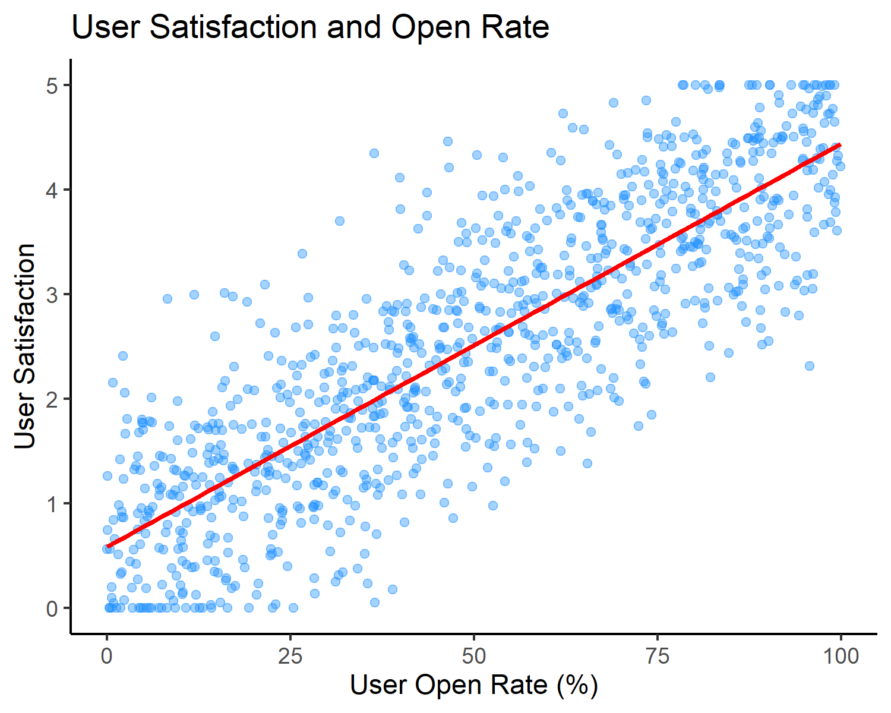
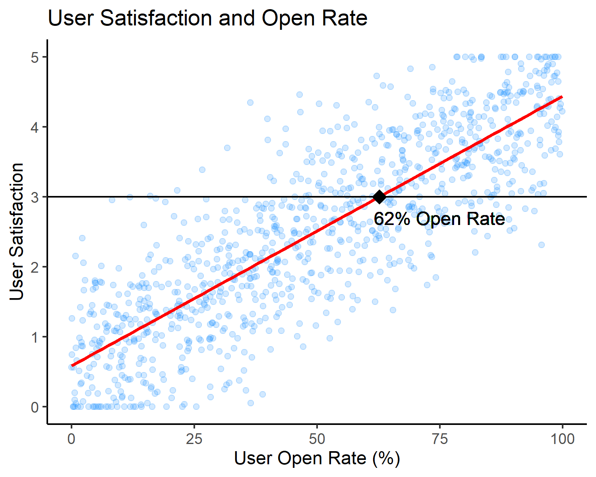

title: Data Science Blog
description: UBC-MDS DSCI 542 Lab2

### Regression analysis, what is it and how to translate results into decisions?

#### Motivation
You and your team are working on a new digital product.  During beta testing user surveys are conducted regularly, and user behaviours such as open rates and click-through rates are tracked by a user analytic platform.  Your goal is to create user profiles to determine who to target and think of when building your product.  Two key variables of interest have been identified, user's self reported satisfaction score and the user's open rates.  Users were asked to score their satisfaction on a continuous scale of 0-5.  Open rate is calculated as the percentage of emails opened by the user (emails opened/emails sent), emails are sent daily by the product.  

Your data analyst excitedly tells you they have found statistically significant results between these two variables using a regression analysis!  They report the regression coefficient, p-value, and confidence interval of their results, seen in the table below, but what does this mean for you?  How can you take these results and translate them into action?  

|Variable | Regression Coefficient | p-value | 95% Confidence Interval |
|----------|:------------------------:|:--------:|:-------------------------:|
|Open Rate | 0.039| 0.00| 0.037-0.04|

#### Regression Analysis
Regression analysis is a type of statistical modeling that attempts to find the relationship between two (or more) variables.  There are many names for these variables, independent and dependent, explanatory and explained, predictor and predicted, or input and output. Regardless of what you call them, we want to know how the change in one (or more) independent variable(s) is associated with the change in the dependent variable.  

We can then use the results of this analysis in prediction and forecasting.  Given the value(s) of the independent/input variable(s) we can use it to predict the approximate value of the dependent/output variable.  The most common type of regression analysis is linear regression, where the relationship between the variables seems linear so if you increase the independent variable the dependent variable also increases.  In linear regression we can only have one dependent variable but can have many independent variables, there are different types of regression that can handle additional dependent variables such as multivariate regression. We calculate a line that best fits the data to estimate that relationship and make predictions.   The red line represents our linear regression model.

#### Statistical Significance and P-values
So, what does statistically significant mean?  During beta testing, the beta users represent a sample of all future users.  How do we know that the relationship between variables seen in the sample is not due to chance and will still exist when the product launches?  This is where the concept of statistical significance comes into play.   

Every statistical test starts with a null-hypothesis that we are trying to disprove, in our case it’s “User satisfaction is unrelated (i.e. has no relationship) to open rate”, our p-value tell us how often this null hypothesis is true.  In practice this is all done by the computer, so we don’t need to worry too much about how the calculation is done.  The p-value will always be between 0 and 1.  If the p-value is 0.25 that means that the null hypothesis was true 25% of the time.  Convention states that if the p-value is below 0.05 that our results are significant and are unlikely to be due to chance.  In our situation the p-value is approximately 0, meaning we are very sure the null hypothesis is not true and that a relationship exists. 

If the results of our analysis are not statistically significant, when the p-value is greater than 0.05, it means that we do not have enough evidence to reject our null-hypothesis and we cannot be certain that a relationship exists between our variables.  This isn't something we can control as it is a property of the sample data we collected.  To continue to test this hypothesis we can take another sample, for our case this would mean more beta testing with different users.

#### Interpreting Results
So now we know that the relationship likely exists, but what exactly is that relationship?   Let’s look at the regression coefficient.  The regression coefficient represents the slope of the red regression line seen above, in other words it represents how much (and in what direction) does satisfaction change when open rate increases by 1%.   Our coefficient is 0.039, meaning that a 1% increase in open rate is associated with an increase in satisfaction score of 0.039.  While this number is quite small if we look at only a 1% increase, but what about a 10% or a 25% increase in open rate?  These increases in open rates are associated with an increase in satisfaction score of 0.39 and 0.975 respectively. 

How confident are we in that number?  Looking at the confidence interval reported by our analyst, we can say that we are 95% confident that the true slope is somewhere between 0.037 and 0.4. Since this isn’t a very large range, we know that we are pretty confident in our estimate! 

#### Decision Making
Now that we understand the analysis and results, how can we use that information to make a decision?  One might think that if we want to increase satisfaction, we should try to increase open rate, this assumes a causal relationship - that higher open rates *causes* higher satisfaction.  We need to be really careful about assuming causation, our model had only determined an *association* between satisfaction and open rate, there may be other factors we didn’t consider that cause the increase in both.  

We want our users to be satisfied with our product, for example let’s say satisfaction score of 3 and above.  Our target user profile would be someone with an open rate of approximately 62% or above.  

So what type of users have these higher open rates?  If we don't already have this data, our next step could be to conduct targeted surveys with users above this threshold to determine if there are additional indicators we can use for further analysis.  If we did already have this information on our users, for example we know that people who use our product for business purposes have open rates above this threshold, we could expand our analysis to control for personal versus business use.  We might see the same relationship between satisfaction and open rate for both groups, but it might only hold true for business users.  This type of information can help streamline the product design, in this case maybe having different settings for business and personal users. 

#### References
<https://hbr.org/2016/02/a-refresher-on-statistical-significance>  
<https://en.wikipedia.org/wiki/Regression_analysis>